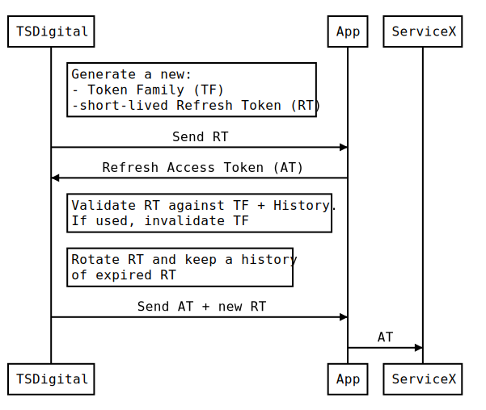

# FullStack-SDK

This repository collects a few components that help you build a modern Web Application with the following core values in mind:

- The Developer Experience matters
- The Development Environment is automated
- The Development Environment is stateless
- The Development Environment is reproducible
- We follow Test Driven Development principles
- We maximize parallel work streams

## Start Coding

The following commands have been tested on MacOSX with Docker and on GitPod.  
You need `Docker` to be up and running on your system.

```bash
# Start & Stop
make start
make stop

# Full State Reset
# (it will also rebuild all the containers)
make reset
```

or click this button to enjoy a **Remote Development Environment**:

[](https://gitpod.io#https://github.com/revisohq/fullstack-sdk)

## Table of Contents

- [Project's Composition](#projects-composition)
- [Automated Development Environment](#automated-development-environment)
- [Docker & DockerCompose](#docker--dockercompose)
  - [Types of Containers](#types-of-containers)
  - [Dependencies Between Services](#dependencies-between-services)
  - [Ports Mapping](#ports-mapping)
  - [Volumes Mapping](#volumes-mapping)
  - [Environmental Variables & Secret](#environmental-variables--secrets)
- [The Make Interface](#the-make-interface)
  - [make start](#make-start)
  - [make stop](#make-stop)
  - [make test](#make-test)
  - [make restart](#make-restart)
  - [make reset](#make-reset)
  - [make build](#make-build)
  - [make clean](#make-clean)
- [PostgreSQL](#postgresql)
  - [Schema Management & Migrations](#schema-management--migrations)
  - [Serverless Functions with TDD](#serverless-functions)
  - [TDD on PostgreSQL](#tdd-on-postgresql)
- [Hasura.io](#hasuraio)
  - [The Architectural Role of Hasura](#the-architectural-role-of-hasura)
  - [Migrations & State Management](#migrations--state-management)
  - [Point & Click Configuration](#point--click-configuration)
- [State Management Utilities](#state-management-utilities)
  - [make hasura-console](#make-hasura-console)
  - [make hasura-apply](#make-hasura-apply)
  - [make hasura-export](#make-hasura-export)
- [JSON Web Tokens](#json-web-tokens)
- [JavaScript](#javascript)
  - [ForrestJS](#forrestjs)
  - [Fastify](#fastify)
  - [Axios](#axios)
  - [Jsonwebtoken](#jsonwebtoken)
- [AuthenticationLESS Apps](#authenticationless-apps)
- [NodeJS Backend App](#nodejs-backend-app)
  - [Files Structure](#files-structure)
  - [Make & DockerCompose Interface](#make--dockercompose-interface)
  - [NPM Interface](#npm-interface)
  - [TDD & Native Tests](#tdd--native-tests)

---

## Project's Composition

### Services

Services are stuff that in a Production environment we will likely purchase from an external supplier.

- [postgres](./services/postgres/README.md)
- [hasura-engine](./services/hasura-engine/README.md)
- [hasura-console](./services/hasura-console/README.md)
- [migrations](./services/migrations/README.md)
- [adminer](https://www.adminer.org/)

### Apps

Apps are stuff that we build. Our code. Our precious.

- [auth](./apps/auth/README.md)

---

## Automated Development Environment

Striving to improve the Developer Experience to the exteme, this Project provides a high degree of automation:

1. It can run in your browser thanks to [GitPod.io](https://gitpod.io)
2. It builds and run locally thanks to [DockerCompose](https://docs.docker.com/compose/)

We will go in great details regarding the DockerCompose setup, and how to run the system in your local machine.

🔥 But the easiest way to run the project is in a [GitPod Workspace](https://www.gitpod.io/docs/life-of-workspace) 🔥

[](https://gitpod.io#https://github.com/revisohq/fullstack-sdk)

This is made possible by Kuberneted and two small files:

- `.gitpod.yml`
- `.gitpod.Dockerfile`

Without going in much details, you can edit those files to configure your workspace with any kind of sotware that you may think to use on a Linux machine, and any VSCode Extension or configuration that you are used to.

🤬 I don't get any money if you yse GitPod or not... I simply believe is a great tool and sponsor it in a transparent way 🤟.

---

## Docker & DockerCompose

The Development Environment is a composition of **containerized services**. Each service should expose a `Dockerfile` for development and production that is used by a `docker-compose.yml`.

Dependencies resolutions, building steps, development servers, etc **SHOULD BE ABSTRACTED AWAY** from the developer.

Docker & DockerCompose should be the only strict dependency on the Developer's machine. (they are free on Linux)

### Types of Containers

The `docker-compose.yml` for development should be divided in four sections:

- APPS: code that is created and maintained by our Engineers
- TESTS: run containerized tests agains the Apps
- UTILITIES: stuff like Adminer or similar that would not run in production
- SERVICES: anything that we would buy in production  
  <small>(Databases, Redis, ...)</small>

### Dependencies Between Services

We rely on the `depends_on` and `healthcheck` declarations to create a **boot ordered tree** that will reliably boot and instrument the entire Development Environment right after the first `git clone`.

> This is intended as a development facilitation and should have no impact in production.

EXPLANATION:

A **PRODUCTION** environment implements an **eager crash** approach where a service that fails a precondition (eg. the DB is not ready) will simply crash. The runner (Kube? Docker?) will apply a failover policy and restart it.

In a **DEVELOPMENT** environment, the service is likely wrapped by a [File System Monitoring Mechanism](https://www.npmjs.com/package/nodemon) that will rebuild/restart the service any time its source code chages.

In case of a "genuine - bug driven - crash", such event will be catched by the FS Monitor and not by the runner.

> Hence, in development we must be sure that the service's infrastructural preconditions are met BEFORE attempting to start a service.

### Ports Mapping

All the ports that need to be exposed to the host machine should be defaulted using the host's environmental variables:

```
postgres:
  ports:
    - "${POSTGRES_PORT:-5432}:5432"
```

### Volumes Mapping

[[TO BE COMPLETED]]

### Environmental Variables & Secrets

[[TO BE COMPLETED]]

---

## The Make Interface

We aim to simplify the Developer Experience by suggestig a seamless way to interact with any project which is based on a `Makefile`, hence native to virtually any Linux distributions.

### make start

- build Development Containers
- pulls project's dependencies
- boot the entire Development Environment
- prepare the initial state
- show relevant logs

### make stop

- gracefully tears down the Development Environment

### make restart

[Have you tried to turn it off, then on again?](https://www.youtube.com/watch?v=nn2FB1P_Mn8)

- stop
- start

### make reset

Like `make restart`, but it also clean up the state and rebuild any dependency / containers.

👉 It's a fresh start over.

### make build

- build Development Containers ignoring any cache layer
- pulls project's dependencies

### make clean

- stop the system
- removes any kind of local state

### make test

- run all Unit Tests
- reset or prepare the Application State for the tests
- run all E2E Tests

---

## PostgreSQL

PostgreSQL is an Open Source [DBMS](https://en.wikipedia.org/wiki/Database) made by the Aliens to prove their mental superiority. They did it.

PostgreSQL can:

- handle relational data
- handle binary JSON documents
- handle geospatial data
- run server side functions in multiple languages
- provide additional features via extensions
- partition tables boosting big-data performances
- route tables to different disks
- handle push notifications
- **PERFORM UNIT TESTS AND TDD ON POSTGRES**

With the amount of data that we (as Industry) manage in an average size project / service we could use only PG as data management solution and live happily ever after.

_There are of course exceptions to this bold statement._

Most engineers go through life learning a little bit of many things. My challenge for you is to become a deep expert on this powerful tool and see where it take us.

SUGGESTED MATERIALS:

- [PostgreSQL Bootcamp: Go From Beginner to Advanced, 60+hours](https://www.udemy.com/course/postgresqlmasterclass/)
- [AmazingPostgres: a personal notebook](https://github.com/marcopeg/amazing-postgresql)
- [Tips for Tuning PostgreSQL 12 like a Pro | Learn how to prevent Postgres performance problems](https://www.udemy.com/course/postgresql-high-performance-tuning-guide/)

### Schema Management & Migrations

Please refer to the [State Management & Migrations](#state-management--migrations) section.

### Serverless Functions

**Serverless Functions** seem to be a cool new tech.

Or is it?

You hand over a piece of logic - possibly stateless logic - and ask a third party entity to run it for you in connection with API events or Data Events. Simple.

[👉 Well, it's about 40 years that we have this tech.](https://lostechies.com/chadmyers/2010/09/08/a-brief-history-of-programming/)  
**We - as Industry - simply forgot about it.**

Since the ´80s, it is possible to deploy serverless functions into most _DBMS_ such as MSSQL, MySQL, and of course, PostgreSQL.

> The **main argument against** this practice is the difficulty to debug and maintain some logic that becomes part of the state of the App.

But somehow, today we do exactly that with pieces of code (Node, .NET, Java) that we persist into Cloud Provider's state and trust them to execute it for us.

👉 SO IT SEEMS WE OVERCAME THAT HICCUPS TOWARDS SERVERLESS 👈

There are two tools that build confidence with Serverless:

- versioning
- testing

When it comes to Serverless on PostgreSQL we can leverage those tools:

- [State Management & Migrations](#state-management--migrations)
- [Unit Testing on PostgreSQL](#tdd-on-postgresql)

Logical reliability is NOT a problem - and it's never been!

**👉 SCALABILITY IS ANOTHER IMPORTANT SUBJECT TO DISCUSS 👈**

When we put logic on the Application Layer (aka: Servers or Cloud provided Serverless Functions) we can leverage on **HORIZONTAL SCALABILITY**.

> When we deploy Serverless Functions in a DBMS we simply CAN NOT SCALE HORIZONTALLY. Period.

Is it a problem?  
Maybe yes, maybe no.

Up until approximately 10 years (~2010s), **VERTICAL SCALING WAS BOTH DIFFICULT AND LIMITED**. Not to mention expensive.

It wasn't such a good idea to keep scaling up a DBMS Server. Too much work. And the [VERTICAL LIMIT wasn't as high as K2](https://www.imdb.com/title/tt0190865/).

---

But then...

> Take me to the magic of the moment  
> On a glory night  
> Where the children of tomorrow share their dreams
>
> [The Wind of Change by Scorpions](https://www.youtube.com/watch?v=n4RjJKxsamQ)

---

Today (~2020s), the vertical limit is high. Very high. Changing virtual hardware (CPU, Memory, Disks) is a highly automated procedure that we delegate to Terraform or similar infra-as-code tools.

A single (or replicated) DBMS machine has the possibility to scale up and match requirements that are simply mind-blowing.

**👉 TODAY WE CAN MOVE OUR LOGIC (BACK) TO WHERE IT BELONGS 👈**

After all, business logic has born into DBMS (AS400), then it moved out for economical reasons.

It's time to move it back, and make a better usage of the savings!

**NOT EVERYTHING BELONGS TO THE DBMS**

Of course, we have a SOlid (pun inteded) responsibility in choosing what belongs to the DBMS and what not:

- ✅ joining related data definitely belongs to the DBMS.
- 🚫 rendering a PDF definitely doesn't belong to he DBMS.
- 🚧 validating a login and releasing a JWT? Maybe.

One thing is certain: the only real argument agains Database Serverless was MONEY, and it is not a valid argument today.

### TDD on PostgreSQL

As we move logic into the Database Layer we must keep reliability up. Luckily, there is no easier place to do so.

[PGTap](https://pgtap.org/) is a testing framework for Postgres that is:

- easy to learn and use
- [can run in Docker](https://github.com/marcopeg/amazing-postgresql/tree/main/testing/unit-tests)
- can be part of our CI/CD

We can achieve 100% code-coverage for all the business critical data centric logic that we write.

👉 **PLUS:** Tests run in transactions so they are **STATELESS BY DESIGN!** 👈

---

## Hasura.io

[Hasura.io](https://hasura.io/) is a super-charged ORM-like layer that **maps a database schema to a GraphQL API**. And much more.

> Do you remember all the code we used to write to expose APIs, validate tokens, match authorization claims and sanitize parameters?
>
> It's all gone with the wind.

Hasura Engine can:

- map multiple PostgreSQL or MSSQL databases and schemas to a GraphQL APIs effectively federating data access
- manage authentication / authorization via JWT claims or custom authentication services
- provide **fine-grained data access control** implementing declarative rules
- manage live data subscriptions via sockets (and fallback)
- provide a GraphQL API proxy to custom backend services effectively providing **static data-type validation** on REST APIs input/output
- federate multiple custom backends into a single self-documented GraphQL API
- federate remote GraphQL schemas
- manage side effects by forwarding data events to custom backends with safe failover strategies
- manage cron-jobs
- manage migrations

Suggested materials:

- [Performant GraphQL Backend in 1 Day by Using Hasura Engine](https://www.udemy.com/course/develop-graphql-backend-faster-with-hasura/)
- [Getting started docs](https://hasura.io/docs/latest/graphql/core/index.html)
- [The Hasura CLI](https://hasura.io/docs/latest/graphql/core/hasura-cli/index.html)
- [Migrations & Metadata](https://hasura.io/docs/latest/graphql/core/migrations/index.html)
- [Hasura License (Apache2)](https://github.com/hasura/graphql-engine/blob/master/LICENSE)

### The Architectural Role of Hasura

We can use Hasura as our **backend-for-frontend** as so unify how our React App makes server calls.

Most of the **CRUD operations will be described as Hasura schema based API calls**, effectively removing (or postponing) to write boring and error-prone code that is costly to write, test and maintain.

We can **proxy any custom service** through Hasura with simple declarative rules that can be automatically propagated to any environment.

We can **describe maintenance jobs** as Hasura Events and keep the knowledge of those stuff in the Git codebase along with any custom logic.

> Hasura's medatata is Git-controlled.

### Migrations & State Management

Using Hasura.io as backend-for-frontend implies that the Application State is composed by:

1. database(s) schema(s)
2. Hasura(s)' metadata
3. data seeding scripts
4. data snapshots

Points n 1, 2 and 3 are managed by the [Hasura CLI](https://hasura.io/docs/latest/graphql/core/migrations/index.html#how-is-hasura-state-managed) via:

- migrations
- metadata
- seeding

Point n.4 is slightly more complicated and is usually delegated to the DevOps management realm. Long story short, the full state should be restored to a newly supplied environment. The classic name for such a huge responsibility is **Disaster Recovery**.

🔥 You can run this on your host machine after [installing the Hasura CLI](https://hasura.io/docs/latest/graphql/core/hasura-cli/install-hasura-cli.html):

```bash
cd services/migrations
hasura apply migrations
hasura apply metadata
hasura apply seeds
```

🔥 [Or you can use the dockerized state management utilities](#state-management-utilities) 🤟

### Point & Click Configuration

Hasura.io offers a visual management tool called [Hasura Console](https://hasura.io/docs/latest/graphql/core/hasura-cli/hasura_console.html) that can **synchronize point&click actions with the local codebase** for metadata and migrations.

1. our Engineers can operate the Declarative ACL rules, Proxy Actions, setup side-effects and Events using the Visual Console
2. the resulting State Mutation is recorded as [database migrations](#migrations--state-management) and code-changes in a set of YAML files
3. the Team can support the change by offering Code Reviews and testing the branch in [dispsable environments](#disposable-environments--gitpodio)
4. approved changes are automatically distributed to any running environment including the Developer's

> 🔥 You can run this on your host machine after [installing the Hasura CLI](https://hasura.io/docs/latest/graphql/core/hasura-cli/install-hasura-cli.html):

```bash
cd services/migrations
hasura console
```

🔥 [Or you can use the dockerized state management utilities](#state-management-utilities) 🤟

---

## State Management Utilities

This project setup offers a few utilities that you can use via `docker-compose` and the relative `make` interface.

### make hasura-console

It runs a conteinerized version of the [Hasura Console](https://hasura.io/docs/latest/graphql/core/hasura-cli/hasura_console.html) that will be available at port `9695` and `9693`.

> By default it is configured to apply (at boot time):
>
> - migrations
> - metadata
> - seeds.

👉 **Use this console to keep your local metadata in sync with your clickings.** 👈

> Use the console at:  
> http://localhost:9695

### make hasura-apply

It runs a coneinerized version of the `hasura ** apply` command.

> By default it is configured to apply:
>
> - migrations
> - metadata
> - seeds.

### make hasura-export

It runs a coneinerized version of the `hasura ** export` command.

> By default it is configured to export only metadata, but you can also use it to generate a full initial migration.

## JSON Web Tokens

JSON Web Tokens are an open, industry standard [RFC 7519](https://tools.ietf.org/html/rfc7519) method for representing claims securely between two parties.

👉 [JWT.IO allows you to decode, verify and generate JWT](https://jwt.io)

---

## Javascript

Javascript is the language of the web, and the **ONLY REAL FULL-STACK LANGUAGE** available to mankind because it's the only one that runs ALSO on a browser.

> Yes, there are sub-languages like [Typescript](https://www.typescriptlang.org/) that [transpiles](https://en.wikipedia.org/wiki/Source-to-source_compiler) to Javascript and provide features like strict types checking and look more like Object-Oriented languages that many are accustomed to.

**IMHO transpiling is an expensive operation** that slow down the Developer Experience. When you follow [a few Javascript bestpractices](https://marcopeg.com/javascript-the-good-parts-in-2020/), you don't have to worry about performances as the [mighty V8](https://v8.dev/) will kick in with all [its power and fury](https://www.digitalocean.com/community/tutorials/js-v8-engine).

### ForrestJS

The JavaScript Plugin Library

👉 [Go to docs](https://forrestjs.github.io)

### Fastify

Fast and low overhead web framework, for Node.js

👉 [Go to docs](https://www.fastify.io/)

### Axios

Promise based HTTP client for the browser and node.js

👉 [Go to docs](https://axios-http.com/)

### Jsonwebtoken

An implementation of [JSON Web Tokens](https://tools.ietf.org/html/rfc7519).

👉 [Go to docs](https://github.com/auth0/node-jsonwebtoken)

---

## AuthenticationLESS Apps

All the Apps that we build should be **AUTHENTICATION-LESS** meaning that they should receive and persist an existing session that is maintained and secured by a single Authentication Authority.

A very simple technique to achieve acceptable security is [described by Auth0](https://auth0.com/blog/refresh-tokens-what-are-they-and-when-to-use-them/#:~:text=from%20compromised%20tokens.-,Refresh%20Token%20Automatic%20Reuse%20Detection,-Refresh%20tokens%20are) and shown in the following chart.



> The trick is that the first Refresh Token is **intended for immediate use** by the client App. It should have a lifespan of a few seconds, maybe a minute.
>
> We call it [**DELEGATION TOKEN**](./apps/auth/README.md#the-delegation-token).

This information can be safely forwarded via URI param as a malicious interceptor would:

1. have a very short lifespan to produce an attak
2. any racing condition with the legit/malicious user would invalidate the entire session

👉 For a realistic damage to take place, a malicious attacker would have to **refresh the token BEFORE the legitimate bearer** makes her first attempt. In such a case, the attacker would have a valid Access Token in his hands. And that should be short-lived anyway.

💡 This event could be **FURTHERLY MITIGATED** by delaying the First Refresh giving time for a racing condition to take place BEFORE releasing the Access Token.

It would make for a slower First Page Loading Time, but would greatly increase security. With such combination, the only possible way to breach would be in case of a full hijacking of the redirect. Basically a bad guy sitting in front of an authenticated browser. But that's beyond service-to-service security.

<!--
# https://bramp.github.io/js-sequence-diagrams/
Note right of Authentication Authority (AA): Generate a new:\n- Session Token (ST)\n- short-lived Refresh Token (RT)
Authentication Authority (AA)->App: Send Refresh Token via URI
App->Authentication Authority (AA): Refresh Access Token (AT) using RT
Note right of Authentication Authority (AA): Validate RT against ST + History.\nIf used, invalidate ST
Note right of Authentication Authority (AA): Rotate RT and keep a history\nof expired RTs
Authentication Authority (AA)->App: Send AT + new long-lived RT
App->ServiceX: Use Application Token (AT)
-->

---

## NodeJS Backend App

You can use the `apps/auth` as codebase reference for this section.

### Files Structure

- `src/` - [refer to a ForrestJS App structure](https://forrestjs.github.io/howto/my-first-rest-api/)
  - `services/`
  - `features/`
  - `index.js` - App's entry point
- `test/`
  - `cases/` - E2E test cases
  - `templates/` - Jest templates configuration
- `jest.config.js` - Jest main configuration
- `package.json` - List dependencies and [NPM Scripts](https://docs.npmjs.com/cli/v8/using-npm/scripts)

### Make & DockerCompose Interface

The NodeJS App offers a dockerized Development Environment that:

- runs the App and exposes the port
- monitors the `/src` folder and restard the process
- runs Unit and E2E tests

The same Make APIs are replicated suffixed by the App's name:

```bash
make start-auth
make stop-auth
make test-auth
make build-auth
```

The App provides a `Dockerfile.dev` that builds the Development Container with the NPM dependencies.

**🚧 NOTE:** when you add a new NPM dependency by changing the `package.json` file, you must rebuild the Development Container by running `make build-auth`.

### NPM Interface

Running the App via NPM may not be that easy and it doesn't provide much of an advantage.

The interface is the classic:

```bash
cd services/auth
npm install
npm start
```

But you must provide all the relevant environmental variables that are documented in the `docker-compose.yml`.

### TDD & Native Tests

Running tests is a different matter and it's as easy as:

```bash
cd services/auth
npm install

# Run both Unit and E2E:
npm test

# Start a TDD session:
npm run tdd:unit
npm run tdd:e2e
```

👉 A TDD session will run the tests and monitor for changes in the soure files, then run it again.

It is a very efficient way of work as you never have to really move your hands away from your keyboard.

> I usually keep 2 Terminal sessions as a side-panel in VSCode
> and run both Unit and E2E TDD.

The E2E tests must communicate with the running App to perform tests via API calls. Hence they need to know WHERE to reach for the App.

The **DEFAULT APP PORT** is hard-coded in `test/templates/e2e/jest.env.js` but you can easily configure it by providing an environmental variable `TEST_URL` via CLI or `.env.development` file.

👉 Environmental files are sourced by the Test Runner using [dotenv](https://www.npmjs.com/package/dotenv).
