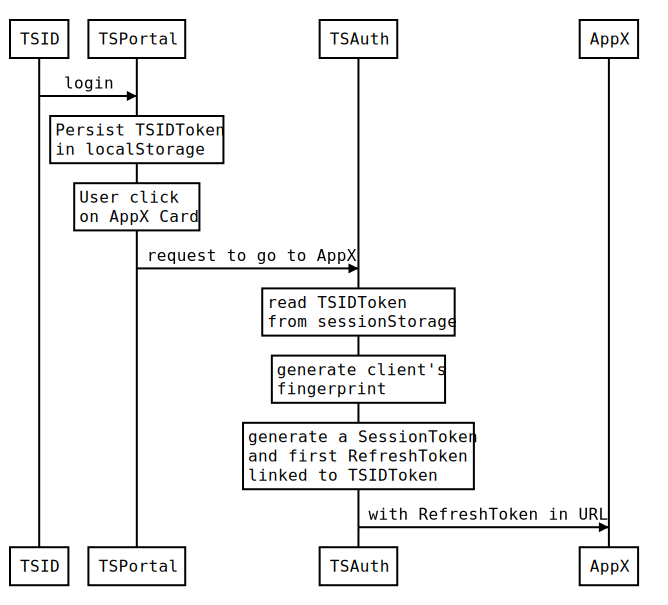
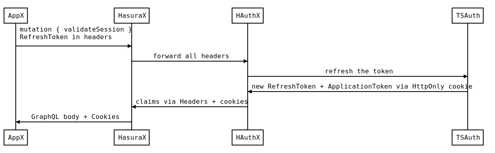
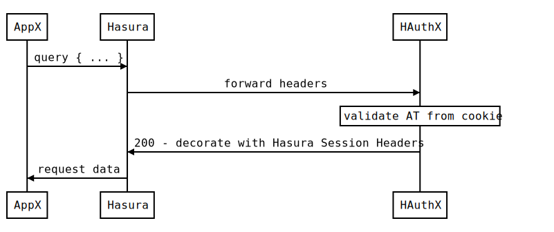
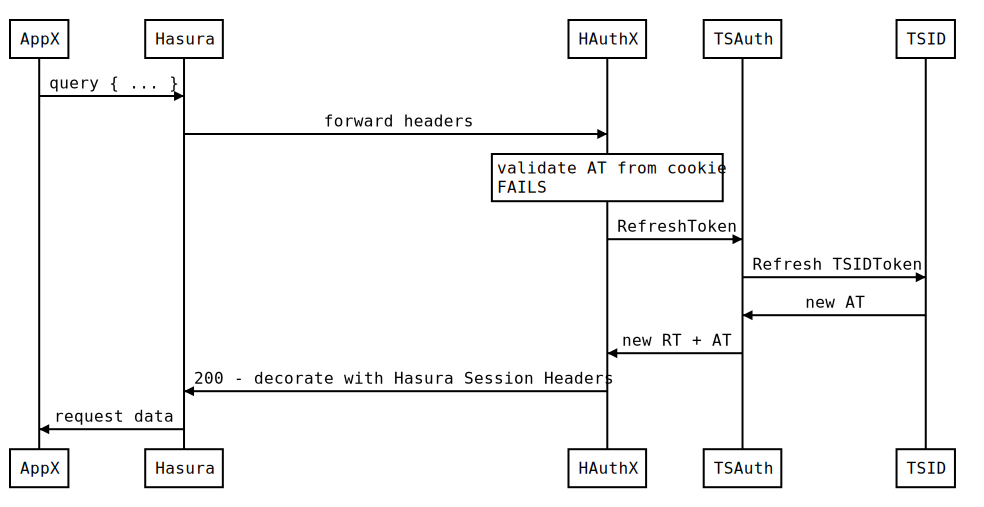

# Hasura Auth with Headers Forwarding

Edit this source on:  
https://bramp.github.io/js-sequence-diagrams/

---

## Create the Session

The SessionToken is a logical connection between a user session in TSDigital (via TSID) and a _Delegated Session_ (DS) towards a 3rd party App.

The DS is sent via URL to the Target App using a intermediate, short-lived Refresh Token.

> NOTE: the session in TSAuth is liked to the session in TSPortal and both are dependent on the TSID behavior.
>
> If TSID rotates the Refresh Token, we will experience racing conditions that will invalidate the session.
>
> Such a case must be verified as it would be an impediment to the external implementation of TSAuth.

## Validate the Session

## Consume the Session

## Refresh the Session

