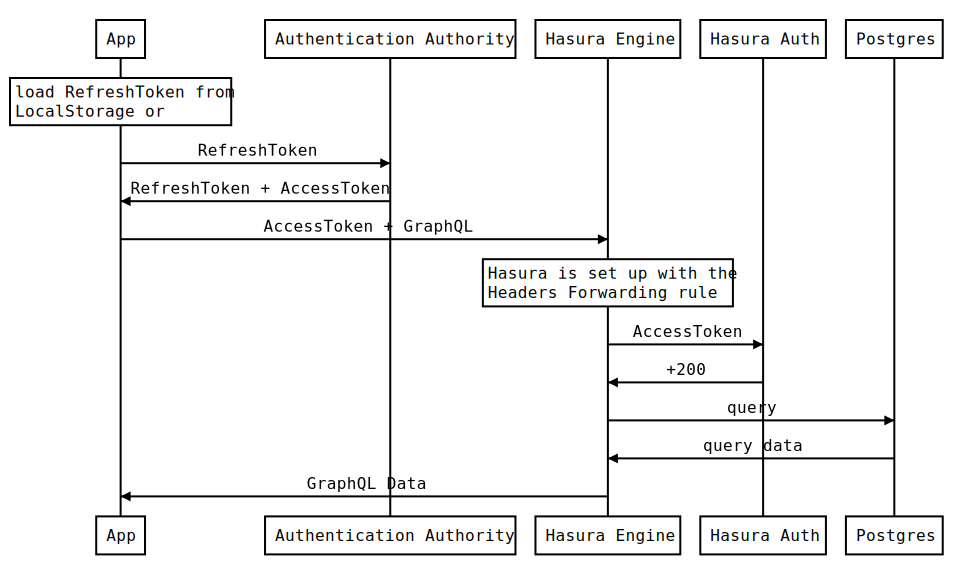

# Hasura Auth with Headers Forwarding



### Source

```
Note over App: load RefreshToken from\nLocalStorage or
App->Authentication Authority: RefreshToken
Authentication Authority->App: RefreshToken + AccessToken
App->Hasura Engine: AccessToken + GraphQL
Note over Hasura Engine: Hasura is set up with the\nHeaders Forwarding rule
Hasura Engine->Hasura Auth: AccessToken
Hasura Auth->Hasura Engine: +200
Hasura Engine->Postgres: query
Postgres->Hasura Engine: query data
Hasura Engine->App: GraphQL Data
```

Edit this source on:  
https://bramp.github.io/js-sequence-diagrams/
