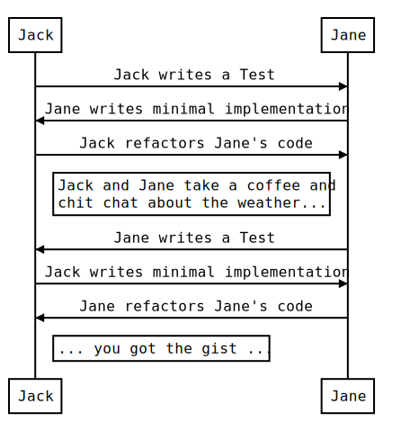
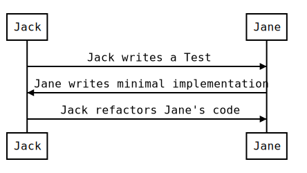
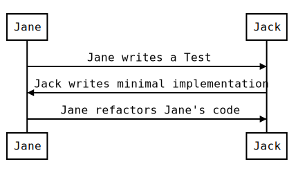

# Hasura Auth with Headers Forwarding







### Source

```
Jack -> Jane: Jack writes a Test
Jane -> Jack: Jane writes minimal implementation
Jack -> Jane: Jack refactors Jane's code
Note right of Jack: Jack and Jane take a coffee and\nchit chat about the weather...
Jane -> Jack: Jane writes a Test
Jack -> Jane: Jack writes minimal implementation
Jane -> Jack: Jane refactors Jane's code
Note right of Jack: ... you got the gist ...
```

Edit this source on:  
https://bramp.github.io/js-sequence-diagrams/
